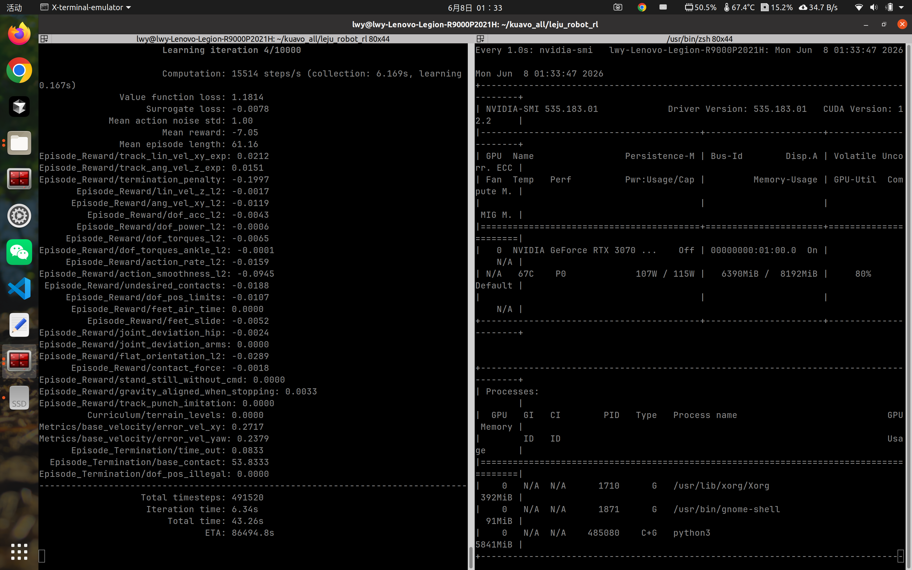
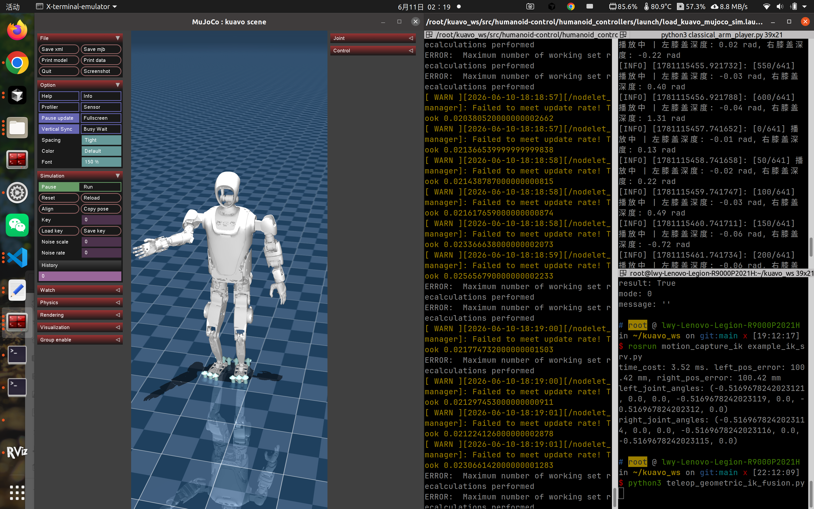
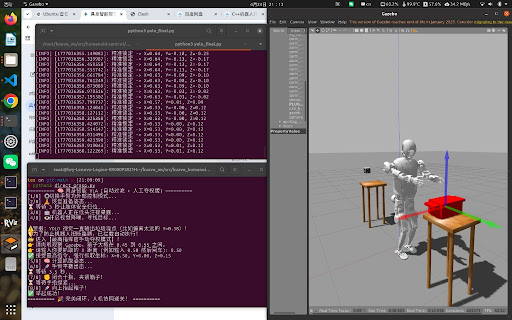

# S49 四代机 IL+RL 全身舞全流程终端指令

> **📌 23.x 扩展版已发布**：`23.1`–`23.5` 各约 1000 行。**终端命令以 `23.5` 扩展版为准**（lite URDF、2048 envs、逐步解读）。


**适用硬件**：Nvidia 独显（训练显存建议 ≥8GB）  
**系统环境**：Ubuntu 20.04/22.04 + Docker（部署）  
**核心框架**：Isaac Lab 1.4.1 + rsl_rl + ROS Noetic + MuJoCo  

**统一版本策略**：训练 / MuJoCo / 真机全部使用 **ROBOT_VERSION=49**，与原有 S42/S46 链路并行、互不影响。

**关联文档**：

- 训练环境与避坑：`15.1.RL_lab_train.md`
- Sim2Sim 通用流程：`15.3RL_lab_sim_to_sim.md`
- 真机 sim2real 经验：`15.4RL_lab_sim_to_real.md`

---

## 目录

- [第零章：一次性准备](#第零章一次性准备)
- [第一章：训练前护城河](#第一章训练前护城河每次训练前执行)
- [第二章：Isaac Lab 训练](#第二章isaac-lab-训练-s49-全身舞)
- [第三章：回放与 ONNX 导出](#第三章回放与-onnx-导出)
- [第四章：部署环境准备与编译](#第四章部署环境准备与编译)
- [第五章：MuJoCo Sim2Sim](#第五章mujoco-sim2sim)
- [第六章：真机部署](#第六章真机部署)
- [附录：路径与占位符速查](#附录路径与占位符速查)

---

## 第零章：一次性准备

### 0.1 Isaac 训练环境（与 15.1 相同）

> 若已按 `15.1.RL_lab_train.md` 完成 Isaac Lab / conda / pip 安装，可从 0.2 开始。

```bash
conda activate isaaclab
cd ~/kuavo_all/leju_robot_rl

source ~/.local/share/ov/pkg/isaac-sim-4.2.0/setup_python_env.sh
export EXP_PATH=$HOME/IsaacLab/source/apps/isaaclab.python.headless.kit
export CARB_APP_PATH=$HOME/.local/share/ov/pkg/isaac-sim-4.2.0/kit
export ISAAC_PATH=$HOME/.local/share/ov/pkg/isaac-sim-4.2.0
export VK_ICD_FILENAMES=/usr/share/vulkan/icd.d/nvidia_icd.json
export WANDB_MODE=offline
```

### 0.2 S49 URDF/meshes 软链（训练首次必跑）

```bash
cd ~/kuavo_all/leju_robot_rl
bash scripts/tools/setup_s49_training_assets.sh
```

脚本会从 `kuavo-ros-opensource` 软链 `biped_s49` 到训练资产目录，并生成 Isaac 可用的 `biped_s49_rl.urdf`。

若 S49 模型不在默认路径，可指定：

```bash
export KUAVO_S49_SRC=~/kuavo_all/kuavo-ros-opensource/src/kuavo_assets/models/biped_s49
bash scripts/tools/setup_s49_training_assets.sh
```

### 0.3 部署侧：补全 biped_s49 MuJoCo 模型

`kuavo-rl-opensource` 自带 `kuavo_assets` **不含** `biped_s49`，Sim2Sim 前需软链：

```bash
ln -sfn ~/kuavo_all/kuavo-ros-opensource/src/kuavo_assets/models/biped_s49 \
  ~/kuavo_all/kuavo-rl-opensource/kuavo-robot-deploy/src/kuavo_assets/models/biped_s49

# 确认 RL 场景文件存在
ls ~/kuavo_all/kuavo-ros-opensource/src/kuavo_assets/models/biped_s49/xml/scene_rl.xml
ls ~/kuavo_all/kuavo-rl-opensource/kuavo-robot-deploy/src/kuavo_assets/models/biped_s49/xml/scene_rl.xml
```

---

## 第一章：训练前护城河（每次训练前执行）

与 `15.1.RL_lab_train.md` §4 相同，防止僵尸进程、X11 段错误、环境变量丢失：

```bash
# 1. 清僵尸进程与缓存锁
pkill -9 -f kit
pkill -9 -f python
rm -rf ~/.local/share/ov/pkg/isaac-sim-4.2.0/kit/cache/*

# 2. 激活环境
conda activate isaaclab
cd ~/kuavo_all/leju_robot_rl

# 3. headless 训练：切断 DISPLAY
unset DISPLAY

# 4. Isaac 底层环境变量
source ~/.local/share/ov/pkg/isaac-sim-4.2.0/setup_python_env.sh
export EXP_PATH=$HOME/IsaacLab/source/apps/isaaclab.python.headless.kit
export CARB_APP_PATH=$HOME/.local/share/ov/pkg/isaac-sim-4.2.0/kit
export ISAAC_PATH=$HOME/.local/share/ov/pkg/isaac-sim-4.2.0
export VK_ICD_FILENAMES=/usr/share/vulkan/icd.d/nvidia_icd.json
export WANDB_MODE=offline
```

---

## 第二章：Isaac Lab 训练（S49 全身舞）

| 项目 | 值 |
|------|-----|
| Gym 任务 | `Legged-Isaac-Velocity-Flat-Kuavo-S49-Punch-v0` |
| 训练配置 | `config/s49/punch_env_cfg.py` |
| 机器人资产 | `Kuavos49_CFG`（S49 URDF） |
| 舞蹈 CSV | `kuavo_action_S49_FROM_S54_INPLACE_RAD.csv`（1565 帧 @ 50Hz） |
| 日志目录 | `logs/rsl_rl/Kuavo/s49/dance/<RUN_DATE>/` |

### 2.1 极限挂机训练（推荐）

```bash
python3 scripts/rsl_rl/train.py \
  --task Legged-Isaac-Velocity-Flat-Kuavo-S49-Punch-v0 \
  --num_envs 8192 \
  --headless

# 可选：关屏幕省电
sleep 3 && xset dpms force off
```

显存不足时降低并行数：

```bash
python3 scripts/rsl_rl/train.py \
  --task Legged-Isaac-Velocity-Flat-Kuavo-S49-Punch-v0 \
  --num_envs 4096 \
  --headless
```

### 2.2 录像抽检（内存小勿开大 num_envs）

> ⚠️ `--video` 会占用大量内存，16GB 机器请用 256 及以下 `num_envs`。

```bash
python3 scripts/rsl_rl/train.py \
  --task Legged-Isaac-Velocity-Flat-Kuavo-S49-Punch-v0 \
  --num_envs 256 \
  --headless \
  --video
```

### 2.3 TensorBoard 看曲线

```bash
conda activate isaaclab
cd ~/kuavo_all/leju_robot_rl
tensorboard --logdir=logs/rsl_rl
# 浏览器打开 http://localhost:6006/
```

---

## 第三章：回放与 ONNX 导出

> 将 `<RUN_DATE>`、`<CHECKPOINT>` 替换为实际 run 文件夹名和 checkpoint 文件名。  
> 例：`export RUN_DATE=2026-06-15_03-40-50` / `export CHECKPOINT=model_9999.pt`

### 3.1 导出 ONNX（headless，导出后 Ctrl+C）

`play.py` 启动后会**自动**导出 ONNX；看到 `exported/` 目录有文件即可退出。

```bash
conda activate isaaclab
cd ~/kuavo_all/leju_robot_rl
unset DISPLAY
source ~/.local/share/ov/pkg/isaac-sim-4.2.0/setup_python_env.sh
export EXP_PATH=$HOME/IsaacLab/source/apps/isaaclab.python.headless.kit
export CARB_APP_PATH=$HOME/.local/share/ov/pkg/isaac-sim-4.2.0/kit
export ISAAC_PATH=$HOME/.local/share/ov/pkg/isaac-sim-4.2.0

python3 scripts/rsl_rl/play.py \
  --task Legged-Isaac-Velocity-Flat-Kuavo-S49-Play-v0 \
  --load_run <RUN_DATE> \
  --checkpoint <CHECKPOINT> \
  --num_envs 32 \
  --headless
```

导出产物路径：

```text
~/kuavo_all/leju_robot_rl/logs/rsl_rl/Kuavo/s49/dance/<RUN_DATE>/exported/
  ├── policy.onnx       ← 部署用这个，重命名为 policy_s49.onnx
  ├── policy_s42.onnx   ← play.py 固定生成，S49 部署勿用
  └── policy.pt
```

### 3.2 拷贝并重命名为 S49 部署策略

```bash
export RUN_DATE=<RUN_DATE>

cp ~/kuavo_all/leju_robot_rl/logs/rsl_rl/Kuavo/s49/dance/${RUN_DATE}/exported/policy.onnx \
   ~/kuavo_all/kuavo-rl-opensource/kuavo-robot-deploy/src/humanoid-control/humanoid_controllers/model/networks/policy_s49.onnx

ls -lh ~/kuavo_all/kuavo-rl-opensource/kuavo-robot-deploy/src/humanoid-control/humanoid_controllers/model/networks/policy_s49.onnx
```

### 3.3 录像查看 play 效果（可选）

```bash
python3 scripts/rsl_rl/play.py \
  --task Legged-Isaac-Velocity-Flat-Kuavo-S49-Play-v0 \
  --load_run <RUN_DATE> \
  --checkpoint <CHECKPOINT> \
  --num_envs 256 \
  --headless \
  --video \
  --video_length 400
```

---

## 第四章：部署环境准备与编译

与 `15.3RL_lab_sim_to_sim.md` 第二、四阶段相同，**版本改为 49**。

### 4.1 拉取 / 更新 deploy 仓（首次）

```bash
cd ~
git clone -b beta https://gitee.com/leju-robot/kuavo-rl-opensource.git
cd ~/kuavo-rl-opensource
git stash
git checkout beta
git pull origin beta
git submodule update --init --recursive
```

已有 `kuavo_all` 布局时：

```bash
cd ~/kuavo_all/kuavo-rl-opensource
git checkout beta
git pull origin beta
git submodule update --init --recursive
```

### 4.2 Docker 编译

```bash
cd ~/kuavo_all/kuavo-rl-opensource/kuavo-robot-deploy

docker run -it --rm \
    --name kuavo_rl_deploy_container \
    --gpus all \
    --privileged \
    --network host \
    --env="DISPLAY" \
    -v /tmp/.X11-unix:/tmp/.X11-unix:rw \
    -v $(pwd):/root/kuavo_ws \
    kuavo_opensource_mpc_wbc_img:1.3.0 \
    zsh
```

**容器内：**

```bash
export ROBOT_VERSION=49
cd /root/kuavo_ws

catkin clean -y
source installed/setup.zsh
catkin build humanoid_controllers
source devel/setup.zsh
```

> 容器内同样需要 `biped_s49` 模型。若 MuJoCo 报找不到 `scene_rl.xml`，在**宿主机**先完成 0.3 节软链后再进容器编译。

---

## 第五章：MuJoCo Sim2Sim

| 项目 | 值 |
|------|-----|
| RL 参数 | `config/kuavo_v49/rl/skw_rl_param_dance.info` |
| 策略文件 | `model/networks/policy_s49.onnx` |
| 观测维度 | 115（含 referenceJointPos 26 维） |
| 推理频率 | 50 Hz |
| cycleTime | 31.30 s（1565 帧 CSV / 50 Hz） |

### 5.1 启动仿真（推荐专用 launch）

**容器内或本机已 source 的工作空间：**

```bash
cd ~/kuavo_all/kuavo-rl-opensource/kuavo-robot-deploy
source devel/setup.zsh
export ROBOT_VERSION=49

roslaunch humanoid_controllers load_kuavo_mujoco_sim_dance_s49.launch joystick_type:=sim
```

等价手动指定：

```bash
export ROBOT_VERSION=49
source devel/setup.zsh

roslaunch humanoid_controllers load_kuavo_mujoco_sim.launch \
  joystick_type:=sim \
  rl_param:=$(rospack find humanoid_controllers)/config/kuavo_v49/rl/skw_rl_param_dance.info \
  inference_frequency:=50
```

### 5.2 键盘接管（在 launch 终端内）

舞蹈策略速度指令恒为 0，**不需要 W/A/S/D**：

1. **`R`** — 进入 RL 控制
2. **`F`** — START / 准备
3. **`P`** — Walkenable / 解锁

等 MuJoCo 窗口 **Run** 变绿、机器人站稳约 2 秒后再按。

### 5.3 抗推测试（新开终端，同 15.3 §5.3）

```bash
source devel/setup.zsh

rostopic info /external_wrench

# 向前 100N @ 50Hz
rostopic pub /external_wrench geometry_msgs/Wrench '{force: {x: 100.0, y: 0.0, z: 0.0}, torque: {x: 0.0, y: 0.0, z: 0.0}}' -r 50

# 停止施力
rostopic pub /external_wrench geometry_msgs/Wrench '{force: {x: 0.0, y: 0.0, z: 0.0}, torque: {x: 0.0, y: 0.0, z: 0.0}}' -1
```

> ⚠️ zsh 下整条 YAML 必须用**单引号**包裹，否则 `{}` 会被当作 brace expansion 拆坏。

---

## 第六章：真机部署

> S49 统一链路**不需要** 15.4 中 `ROBOT_VERSION=45` 的「移花接木」。  
> 仍建议按 `15.4RL_lab_sim_to_real.md` 从 bag 标定 `kuavo_v49/command/reference.info` 的 com 高度、滤波、手臂 Kp 等。

| 项目 | 值 |
|------|-----|
| RL 参数 | `config/kuavo_v49/rl/skw_rl_param_dance.info` |
| 策略文件 | `model/networks/policy_s49.onnx` |
| 舞蹈 CSV | `config/kuavo_v49/rl/kuavo_action_S49_FROM_S54_INPLACE_RAD.csv` |

### 6.1 下位机编译（首次或改配置后）

```bash
sudo systemctl stop ocs2_h12pro_monitor.service
sudo pkill -f ros

cd ~/kuavo-robot-deploy
export ROBOT_VERSION=49
source devel/setup.bash
catkin build humanoid_controllers
```

### 6.2 拷贝策略到下位机（训练机 ≠ 下位机时）

```bash
scp ~/kuavo_all/kuavo-rl-opensource/kuavo-robot-deploy/src/humanoid-control/humanoid_controllers/model/networks/policy_s49.onnx \
    lab@<下位机IP>:~/kuavo-robot-deploy/src/humanoid-control/humanoid_controllers/model/networks/

scp ~/kuavo_all/kuavo-rl-opensource/kuavo-robot-deploy/src/humanoid-control/humanoid_controllers/config/kuavo_v49/rl/skw_rl_param_dance.info \
    lab@<下位机IP>:~/kuavo-robot-deploy/src/humanoid-control/humanoid_controllers/config/kuavo_v49/rl/

scp ~/kuavo_all/kuavo-rl-opensource/kuavo-robot-deploy/src/humanoid-control/humanoid_controllers/config/kuavo_v49/rl/kuavo_action_S49_FROM_S54_INPLACE_RAD.csv \
    lab@<下位机IP>:~/kuavo-robot-deploy/src/humanoid-control/humanoid_controllers/config/kuavo_v49/rl/
```

### 6.3 真机点火

```bash
cd ~/kuavo-robot-deploy
source devel/setup.bash
export ROBOT_VERSION=49

roslaunch humanoid_controllers load_kuavo_real.launch \
  joystick_type:=h12 \
  inference_frequency:=50 \
  rl_param:=$(rospack find humanoid_controllers)/config/kuavo_v49/rl/skw_rl_param_dance.info
```

### 6.4 遥控器 SOP（同 15.4 §0.3）

- 初始：**E** 拨最左，**F** 拨最右
- 扶躯干 → **F** 拨左（经典 WBC 起立，S49 com_z ≈ 0.85）
- 站稳松手 → **B**（INTO RL-Control，舞蹈神经网络接管）
- 急停：**E** 拨右 或 `Ctrl+C`

---

## 附录：路径与占位符速查

### 占位符

```bash
export RUN_DATE=2026-06-15_03-40-50    # logs/.../Kuavo/s49/dance/ 下的文件夹名
export CHECKPOINT=model_9999.pt        # 该 run 下的 checkpoint 文件名
```

### 关键路径

| 项目 | 路径 |
|------|------|
| 训练仓 | `~/kuavo_all/leju_robot_rl` |
| 部署仓 | `~/kuavo_all/kuavo-rl-opensource/kuavo-robot-deploy` |
| ROS 资产仓 | `~/kuavo_all/kuavo-ros-opensource` |
| 训练 Gym 任务 | `Legged-Isaac-Velocity-Flat-Kuavo-S49-Punch-v0` |
| 回放 Gym 任务 | `Legged-Isaac-Velocity-Flat-Kuavo-S49-Play-v0` |
| 训练日志 | `logs/rsl_rl/Kuavo/s49/dance/<RUN_DATE>/` |
| ONNX 导出 | `.../exported/policy.onnx` → 重命名 `policy_s49.onnx` |
| 部署 ONNX | `humanoid_controllers/model/networks/policy_s49.onnx` |
| 舞蹈 RL 参数 | `humanoid_controllers/config/kuavo_v49/rl/skw_rl_param_dance.info` |
| MuJoCo launch | `humanoid_controllers/launch/load_kuavo_mujoco_sim_dance_s49.launch` |

### S42/S46 与 S49 对照（原链路保留不变）

| 环节 | S42/S46（原有） | S49（本文件） |
|------|----------------|---------------|
| 训练任务 | `Legged-Isaac-Velocity-Flat-Kuavo-Punch-v0` | `Legged-Isaac-Velocity-Flat-Kuavo-S49-Punch-v0` |
| 机器人模型 | `Kuavos46_CFG` (USD) | `Kuavos49_CFG` (URDF) |
| 部署 RL 参数 | `kuavo_v46/rl/skw_rl_param.info` | `kuavo_v49/rl/skw_rl_param_dance.info` |
| 策略文件 | `policy_s42.onnx` | `policy_s49.onnx` |
| MuJoCo 版本 | `ROBOT_VERSION=46` | `ROBOT_VERSION=49` |

---

## 参考截图





